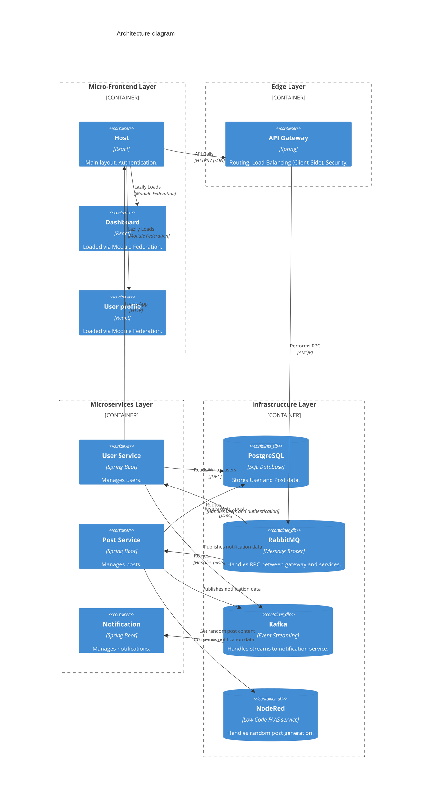
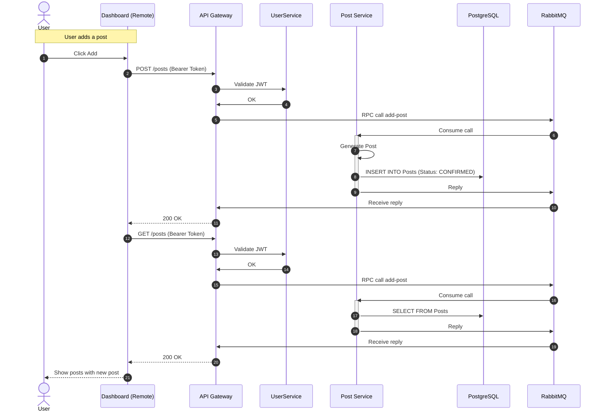

# Microservice Social - A basic social media application using microservices

## 1. Introduction and prerequisites

This is a social media application which is built using microservices. Users can log in, see the posts of other users 
and create their own posts. This application uses a Java Spring backend and a React frontend using a microfrontend architecture.

## 2. Installation

### 1. Clone this repository
```bash
git clone *repo name*
```
### 2. Go into the project repository
```bash
cd MicroserviceSocial
```
### 3. Go into the docker compose file and fill in any missing environment variables
### 4. Potential db initialization issue
if the db does not initialize correctly, run the V1 migration from the user service manually.
### 5. Run docker compose
```bash
docker compose up -d 
```


### 4. Connect on localhost:3000 or localhost:8000 for the api

## 3. Diagrams

### 1. C4 Architecture diagram



### 2. UML activity diagram



